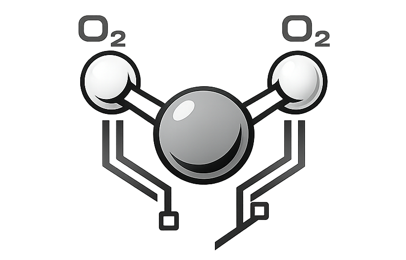

# Silica
<p align="center">
    
<p>

<div align="center">

**Compiled programming language**

[](docs/)
[](https://github.com/Taterraster/silica/releases/latest)
[](LICENSE)
</div>

A statically typed, compiled programming language that targets x86-64 Linux. The compiler produces standalone ELF binaries with **zero external dependencies** — no libc, no runtime, all I/O through raw Linux syscalls.

```silica
import std.io;
import std.main;

main hello() {
    io.println("Hello, World!");
    hello.errorcode = 0;
}
```

```bash
./build/silicac hello.slc -o hello
./hello
# Hello, World!
```

---

## Features

- **Primitive types** — `int`, `long`, `uint`, `byte`, `char`, `bool`, `float`, `string`, `void*`
- **Structs** — `struct Point { int x; int y; }` with dot-access; typedef compound form `typedef struct { } Alias;`
- **Enums** — `enum Color { RED=1, GREEN, BLUE }` with auto-increment; typedef compound form
- **Typedefs** — `typedef int i64;`, `typedef struct Foo Foo;`, inline compound forms
- **Pointers** — `int* p = &x;`, `*p = 42;`, `void*` generic heap pointers
- **Pointer casts** — `(int*)buf`, `(void*)p` typed cast syntax
- **Arrays** — heap-allocated, literal initialisation, index access; `type[]` in function parameters
- **String char indexing** — `string[i]` returns the byte value at position i (ASCII code)
- **Functions** — multiple return types, overloading, full recursion with dynamic stack frames
- **Function qualifiers** — `static` (local linkage), `inline` (inline hint), combinable
- **Forward declarations** — `int foo(int x);` declares a function before its definition
- **Control flow** — `if`/`else if`/`else`, `while`, `for`, `break`, `continue`; legacy `loops.while`/`loops.for` still supported
- **Compound assignment** — `+=`, `-=`, `*=`, `/=`, `%=`, `&=`, `|=`, `^=`, `<<=`, `>>=`
- **Bitwise operators** — `&`, `|`, `^`, `~`, `<<`, `>>`
- **Hex literals** — `0xFF`, `0x1000`, `0xDEAD`
- **Type casting** — `(float)n`, `(int)f`, `(int*)buf`
- **OOP** — `class` with `public`/`private` blocks, `new ClassName obj;`, method dispatch, `extends` inheritance, method override, encapsulation
- **Inline assembly** — `asm("movq $1, %rax");` requires `import std.external.asm;`
- **`import std;`** — imports all stdlib modules at once
- **Modules** — `.slh` header libraries, `.slc` compiled modules, `.so` shared library imports
- **REPL** — interactive session with persistent state
- **Standard library** — `std.io`, `std.math`, `std.str`, `std.fs`, `std.mem`, `std.time`, `std.net`, `std.env`, `std.proc`

---

## Building

**Requirements:** Linux x86-64, GCC, GNU ld, GNU Make

```bash
make              # builds to build/silicac
make install      # copies to /usr/local/bin/silicac
make clean        # removes build/
```

---

## Compiler usage

```bash
./build/silicac source.slc -o binary    # compile to binary
./build/silicac source.slc -c           # compile to .o object
./build/silicac source.slc -lib         # compile to linkable .o library
./build/silicac source.slc -shared      # compile to .so shared library
./build/silicac --tokens source.slc     # dump token stream
./build/silicac --ast source.slc        # dump AST
./build/silicac --asm source.slc        # dump generated assembly
./build/silicac                         # start interactive REPL
```

---

## Language overview

### Program structure

Every executable needs `import std.main;` and a `main` block. Set the exit code at the end:

```silica
import std.io;
import std.main;

main myapp() {
    io.println("Hello!");
    myapp.errorcode = 0;
}
```

### Types

| Type     | Description                     |
|----------|---------------------------------|
| `int`    | 64-bit signed integer           |
| `long`   | Alias for `int`                 |
| `uint`   | 64-bit unsigned integer         |
| `byte`   | Unsigned 8-bit integer          |
| `char`   | Single ASCII character          |
| `bool`   | `true` / `false`                |
| `float`  | 64-bit double                   |
| `string` | Pointer + length pair           |

### Functions and recursion

```silica
int fib(int n) {
    if (n <= 1) { return n; }
    return fib(n - 1) + fib(n - 2);
}

// Overloading — same name, different signatures
void greet(string name) { io.println(name); }
void greet(int n)       { io.println(n); }

// Forward declaration — define later or in another module
int helper(int x);

// Static — local linkage, not exported
static int internal(int x) { return x * 2; }

// Inline — inline hint, local linkage
inline int clamp(int v, int lo, int hi) {
    if (v < lo) { return lo; }
    if (v > hi) { return hi; }
    return v;
}
```

Stack frames are sized dynamically per function — deep recursion works without wasted space.

### Structs

```silica
struct Point {
    int x;
    int y;
}

// Typedef compound form — declare and alias in one go
typedef struct {
    int r;
    int g;
    int b;
} Color;

main example() {
    struct Point p;
    p.x = 3;
    p.y = 4;
    io.println(p.x);

    Color c;
    c.r = 255;
    example.errorcode = 0;
}
```

### Pointers

```silica
void swap(int* a, int* b) {
    int tmp = *a;
    *a = *b;
    *b = tmp;
}

main example() {
    int x = 10;
    int y = 20;
    swap(&x, &y);    // x=20, y=10
    example.errorcode = 0;
}
```

### Control flow

```silica
// if / else if / else
if (score >= 90) {
    io.println("A");
} else if (score >= 80) {
    io.println("B");
} else {
    io.println("C");
}

// counted loop
for (5) { io.println("tick"); }

// conditional loop
int i = 0;
while (i < 10) {
    i += 1;
}

// infinite loop with break
while (true) {
    if (done) { break; }
}
```

### Compound assignment

```silica
int x = 10;
x += 5;   // 15
x -= 3;   // 12
x *= 2;   // 24
x /= 4;   // 6
x %= 4;   // 2
```

### Bitwise operators and hex literals

```silica
int mask = 0xFF;          // 255
int lo   = mask & 0x0F;   // 15
int hi   = mask | 0x100;  // 511
int flip = mask ^ 0x0F;   // 240
int inv  = ~0;            // -1
int shl  = 1 << 4;        // 16
int shr  = 256 >> 3;      // 32

// compound bitwise assign
int flags = 0;
flags |= (1 << 3);        // set bit 3
flags &= ~(1 << 3);       // clear bit 3
```

### Arrays

```silica
int[] nums = {10, 20, 30, 40, 50};
io.println(nums[0]);   // 10
nums[2] = 999;
```

### Modules

```silica
import mathutils;   // finds mathutils.slh or mathutils.slc in same directory

main example() {
    io.println(abs_val(-42));    // function from mathutils
    example.errorcode = 0;
}
```

`.slh` libraries are merged at compile time. `.slc` modules are compiled to `.o` and linked.

---

## Standard library

| Module      | What it provides |
|-------------|-----------------|
| `std.io`    | `print`, `println`, `eprint`, `eprintln`, `input`, `inputln` |
| `std.math`  | `sqrt`, `sin`, `cos`, `log`, `pwr`, `root`, `sigma`, `integral`, `random`, constants `pi`/`e` |
| `std.str`   | `length`, `concat`, `contains`, `slice`, `upper`, `lower`, `trim`, `repeat`, `from_int`, `to_int`, `eq` |
| `std.fs`    | `create`, `open`, `close`, `write`, `read_all`, `size`, `append`, `read`, `delete` |
| `std.mem`   | `alloc` (returns `void*`), `alloc_raw`, `free` |
| `std.time`  | `now`, `now_ms`, `mono`, `sleep` |
| `std.net`   | `ip`, `connect`, `send`, `recv`, `close` |
| `std.env`   | `argc`, `argv`, `get` |
| `std.proc`  | `pid`, `exit` |

Each module must be explicitly imported before use.

---

## Project layout

```
silica/
├── Makefile
├── README.md
├── src/              compiler source (C11)
│   ├── main.c        driver, CLI, REPL, module resolution
│   ├── lexer.c/h     tokeniser
│   ├── parser.c/h    recursive descent parser → AST
│   ├── ast.c/h       AST node types and helpers
│   └── codegen.c/h   AST → x86-64 AT&T assembly
├── build/            compiler binary + object files (generated)
├── tests/            41 .slc test programs + .slh libraries
└── docs/             full documentation
    ├── getting-started.md
    ├── language-reference.md
    ├── stdlib.md
    └── compiler-internals.md
```

---

## How it works

The compiler pipeline:

```
source.slc  →  Lexer  →  Parser  →  Codegen  →  as  →  ld  →  ELF binary
```

No libc. The generated binary for "Hello, World!" calls `sys_write` (syscall 1) and `sys_exit` (syscall 60) directly. All stdlib functions — I/O, math, string ops, networking — are emitted as inline syscall sequences by the code generator. There is no separate runtime.

See [`docs/compiler-internals.md`](docs/compiler-internals.md) for the full internals walkthrough.

---

## Documentation

Full docs are in [`docs/`](docs/):

- **[Getting Started](docs/getting-started.md)** — installation, first program, common patterns
- **[Language Reference](docs/language-reference.md)** — complete syntax reference
- **[Standard Library](docs/stdlib.md)** — all stdlib modules and functions
- **[Compiler Internals](docs/compiler-internals.md)** — lexer, parser, AST, codegen, calling convention

---

## Bootstrapping path

```
Stage 0: silicac (C)      ← current  [v0.0.3]
Stage 1: silicac.slc      compile Stage 0 with Stage 0  ← next
Stage 2: self-hosting     Stage 1 compiles Stage 1
```